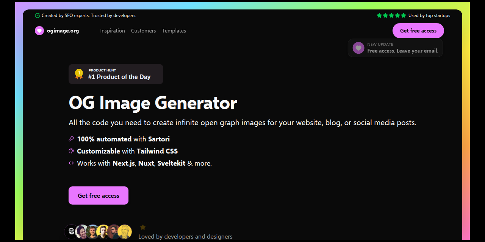

# ogimage.org

Free, open-source Open Graph image kit and a gallery of 300+ real startup OG cards.

**Live site:** [ogimage.org](https://ogimage.org)

<p align="center">
  
</p>

Clone the repo, run it locally, and ship social preview images from Next.js route handlers. No hosted API. No database. Gallery data lives in git.

## What you get

| Piece | Path | License |
| --- | --- | --- |
| OG templates (Satori + Tailwind) | [`app/og/templates/`](./app/og/templates/) | [MIT](./LICENSE.md) |
| Inspiration gallery (git CMS) | [`content/gallery/`](./content/gallery/) + [`public/og/`](./public/og/) | MIT |
| Marketing site chrome | [`components/`](./components/), layouts | [Tailwind UI](./licenses/TAILWIND-UI.md) |

Templates render at **1200×630** through `next/og` `ImageResponse`. Preview them at [/templates](https://ogimage.org/templates) or browse examples at [/inspiration](https://ogimage.org/inspiration).

### Included templates

- **emoji** — single emoji on a gradient
- **icon** — Lucide-style icon grid
- **image** — avatar + name card
- **button** — emoji, headline, and CTA pill
- **headline** — bold headline block
- **screenshot** — live page capture in a frame (needs screenshot API env)
- **phone** — mobile-style screenshot mock
- **city** — geo + Unsplash background (needs `UNSPLASH_KEY`)
- **blog-post** — title, excerpt, and author (`?title=` / `?excerpt=` / `?author=`)

## Quick start

Requires [Bun](https://bun.sh).

```bash
git clone https://github.com/Illyism/ogimage.git
cd ogimage
bun install
cp .env.example .env
bun dev
```

Open [http://localhost:3000](http://localhost:3000).

Email signup and gallery suggestions need Resend keys in `.env`. Everything else runs without them.

## Use a template in your app

Each template is a route under `/og/templates/{name}`. Point `og:image` at your deployed URL:

```html
<meta property="og:image" content="https://your-domain.com/og/templates/headline" />
<meta property="og:image:width" content="1200" />
<meta property="og:image:height" content="630" />
```

For dynamic titles, pass query params where the route supports them:

```html
<meta
  property="og:image"
  content="https://your-domain.com/og/templates/blog-post?title=Launch%20week&author=Acme"
/>
```

Wire defaults through your metadata helper. This repo uses [`core/seo.tsx`](./core/seo.tsx) as a reference.

## Add a site to the gallery

```bash
bun run gallery:add https://example.com saas productivity
```

That writes `content/gallery/example.com.json` and `public/og/example.com.jpg`. Open a PR with both files. Details in [CONTRIBUTING.md](./CONTRIBUTING.md).

## Production

### Docker

```bash
docker build -t ogimage .
docker run -p 3000:3000 --env-file .env ogimage
```

Coolify and other hosts can build from the root [`Dockerfile`](./Dockerfile). The image uses Next.js `output: 'standalone'`.

### Checks before you ship

```bash
bun run check   # lint + typecheck
bun run build   # production build
```

## Environment variables

Copy [`.env.example`](./.env.example) to `.env`.

### Email signup (optional locally)

| Variable | Purpose |
| --- | --- |
| `RESEND_API_KEY` | Resend API key (Contacts permission for audience) |
| `RESEND_AUDIENCE_ID` | Audience for kit signups |
| `CONTACT_EMAIL` | Reply-to and inbox for gallery suggestions (default: `contact@ogimage.org`) |

### Analytics (optional)

| Variable | Purpose |
| --- | --- |
| `NEXT_PUBLIC_POSTHOG_KEY` | PostHog project key |
| `NEXT_PUBLIC_POSTHOG_HOST` | PostHog ingest host |

### Template extras (optional)

| Variable | Purpose |
| --- | --- |
| `SCREENSHOT_API_URL` | Base URL for screenshot capture (`screenshot`, `phone` templates) |
| `SCREENSHOT_API_KEY` | API key for that service |
| `UNSPLASH_KEY` | Unsplash access key for the `city` template |

Without screenshot env vars, screenshot templates fall back to a placeholder image.

## License

Two licenses in one repo:

- **MIT** — `app/og/templates/`, `content/gallery/`, `public/og/`, `lib/gallery.ts`, `scripts/add-og.ts`. Fork and reuse freely.
- **Tailwind UI** — site chrome in `components/` and layouts. Use as part of this app; do not republish as a component library.

See [LICENSE.md](./LICENSE.md) and [licenses/TAILWIND-UI.md](./licenses/TAILWIND-UI.md).

## Links

- [Next.js `ImageResponse`](https://nextjs.org/docs/app/api-reference/functions/image-response)
- [Satori](https://github.com/vercel/satori) (underlying renderer)
- [Open Graph protocol](https://ogp.me/)
