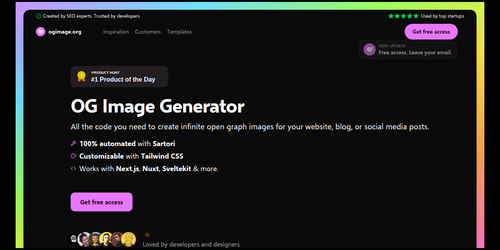

# OG Image: open-source generator, templates, checker, and gallery

Make an **OG image** (Open Graph image) for every page of your site. This repo is the full source of [ogimage.org](https://ogimage.org): a free OG image generator, nine Next.js + Satori templates, an Open Graph checker, and a gallery of 380+ real OG image examples.

<p align="center">
  <a href="https://ogimage.org">
    
  </a>
</p>

No hosted API. No database. MIT license. Clone it, self-host it, and ship your own images.

| Tool | What it does | Live |
| --- | --- | --- |
| **OG image generator** | Type a title, pick colors, download a 1200×630 PNG | [ogimage.org/generator](https://ogimage.org/generator) |
| **OG image templates** | Nine `ImageResponse` routes you can copy into a Next.js app | [ogimage.org/templates](https://ogimage.org/templates) |
| **OG image checker** | Tests the Open Graph tags, image size, and link preview of a URL | [ogimage.org/checker](https://ogimage.org/checker) |
| **OG image gallery** | 380+ real OG image examples from live startups, by category | [ogimage.org/inspiration](https://ogimage.org/inspiration) |

## What is an OG image?

An OG image is the picture that X, Facebook, LinkedIn, Slack, Discord, WhatsApp, and iMessage show when someone shares a link. One meta tag sets it:

```html
<meta property="og:image" content="https://your-domain.com/og/home.png" />
<meta property="og:image:width" content="1200" />
<meta property="og:image:height" content="630" />
<meta name="twitter:card" content="summary_large_image" />
```

The standard **OG image size is 1200×630 pixels** (ratio 1.91:1), as PNG or JPEG, below 1 MB.

Guides: [What is an OG image?](https://ogimage.org/what-is-an-og-image) · [OG image size](https://ogimage.org/og-image-size) · [og:image meta tag](https://ogimage.org/og-image-meta-tag) · [Next.js OG image](https://ogimage.org/nextjs-og-image) · [Open Graph tags](https://ogimage.org/open-graph-tags)

## Quick start

Requires [Bun](https://bun.sh).

```bash
git clone https://github.com/Illyism/ogimage.git
cd ogimage
bun install
cp .env.example .env
bun dev
```

Open [http://localhost:3000](http://localhost:3000). The generator, the templates, the checker, and the gallery run without any keys.

## Generate an OG image in Next.js

Each template is a route handler that returns a 1200×630 PNG through `next/og` `ImageResponse`. Satori renders the JSX. Tailwind classes go in the `tw` prop.

```tsx
// app/og/route.tsx
import { ImageResponse } from 'next/og'
import type { NextRequest } from 'next/server'

export async function GET(request: NextRequest) {
  const title = request.nextUrl.searchParams.get('title') ?? 'Hello'

  return new ImageResponse(
    <div tw="flex h-full w-full items-center justify-center bg-black p-20 text-7xl font-bold text-white">
      {title}
    </div>,
    { width: 1200, height: 630 },
  )
}
```

Point `og:image` at the route:

```tsx
export const metadata = {
  metadataBase: new URL('https://your-domain.com'),
  openGraph: { images: ['/og?title=Launch%20week'] },
  twitter: { card: 'summary_large_image' },
}
```

This repo uses [`core/seo.tsx`](./core/seo.tsx) as the metadata helper.

### Included OG image templates

All templates are in [`app/og/templates/`](./app/og/templates/).

| Template | Card |
| --- | --- |
| `headline` | Bold headline block with a call to action |
| `blog-post` | Title, excerpt, and author (`?title=`, `?excerpt=`, `?author=`) |
| `screenshot` | Live page capture in a frame (needs the screenshot API env) |
| `phone` | Mobile screenshot mock |
| `button` | Emoji, headline, and a button |
| `emoji` | One emoji on a dark card |
| `icon` | Lucide-style icon |
| `image` | Avatar and name |
| `city` | Geo-located city photo (needs `UNSPLASH_KEY`) |

The generator at `/generator` uses one more route, [`app/og/generator/route.tsx`](./app/og/generator/route.tsx), with `?title=`, `?subtitle=`, `?site=`, `?layout=`, `?bg=`, and `?accent=`.

## OG image gallery

The gallery is a git CMS. One site is two files: `content/gallery/{domain}.json` and `public/og/{domain}.{ext}`.

Add one site:

```bash
bun run gallery:add https://example.com saas productivity
```

Find good cards automatically:

```bash
bun run gallery:find                      # YC companies, newest first
bun run gallery:find --source hn          # popular Show HN launches
bun run gallery:find --file sites.txt     # your list, one URL per line
bun run gallery:find --limit 80 --add 15 --min-score 8 --dry-run
```

`gallery:find` fetches each site, rejects images with the wrong size or ratio, and asks Claude to score the design from 1 to 10. Cards that pass get a name, a description, categories, and colors. It needs `ANTHROPIC_API_KEY`.

Open a pull request with the new files. Details are in [CONTRIBUTING.md](./CONTRIBUTING.md).

## Project layout

| Path | Role |
| --- | --- |
| [`app/og/templates/`](./app/og/templates/) | OG image templates (Satori + Tailwind) |
| [`app/generator/`](./app/generator/) | Browser OG image generator |
| [`app/checker/`](./app/checker/) | Open Graph tag and image checker |
| [`app/inspiration/`](./app/inspiration/) | Gallery, category pages, and post pages |
| [`content/gallery/`](./content/gallery/) + [`public/og/`](./public/og/) | Gallery data and images |
| [`content/pages.json`](./content/pages.json) | Guides and static pages |
| [`scripts/`](./scripts/) | `add-og.ts` and `find-og.ts` |

## Production

### Docker

```bash
docker build -t ogimage .
docker run -p 3000:3000 --env-file .env ogimage
```

Coolify and other hosts can build from the root [`Dockerfile`](./Dockerfile). The image uses Next.js `output: 'standalone'`.

### Checks before you ship

```bash
bun run check   # lint + typecheck
bun run build   # production build
```

## Environment variables

Copy [`.env.example`](./.env.example) to `.env`. All variables are optional for local work.

| Variable | Purpose |
| --- | --- |
| `RESEND_API_KEY` | Resend API key for email signup and gallery suggestions |
| `RESEND_AUDIENCE_ID` | Audience for kit signups |
| `CONTACT_EMAIL` | Reply-to and inbox for gallery suggestions (default: `contact@ogimage.org`) |
| `NEXT_PUBLIC_POSTHOG_KEY` | PostHog project key |
| `NEXT_PUBLIC_POSTHOG_HOST` | PostHog ingest host |
| `SCREENSHOT_API_URL` | Base URL for screenshot capture (`screenshot`, `phone` templates) |
| `SCREENSHOT_API_KEY` | API key for that service |
| `UNSPLASH_KEY` | Unsplash access key for the `city` template |
| `ANTHROPIC_API_KEY` | Design review in `bun run gallery:find` |

Without the screenshot variables, the screenshot templates show a placeholder image.

Plausible page views are sent only when the site runs on `ogimage.org`. A fork sends nothing. To use your own Plausible site, change the host and the domain in [`app/layout.tsx`](./app/layout.tsx).

## FAQ

**What size must an OG image be?**
1200×630 pixels. See the [OG image size guide](https://ogimage.org/og-image-size).

**Can I use this without Next.js?**
Yes. Deploy this repo and point the `og:image` tag of any site at a template URL. Or use the [generator](https://ogimage.org/generator) and upload the PNG.

**How do I test my OG image?**
Paste the URL of your page into the [OG image checker](https://ogimage.org/checker).

**Is it free for commercial use?**
Yes. The code is MIT. The gallery images belong to their sites and are shown as examples.

## License

[MIT](./LICENSE.md). Fork the kit, the gallery, and the site.

## Links

- [Next.js `ImageResponse`](https://nextjs.org/docs/app/api-reference/functions/image-response)
- [Satori](https://github.com/vercel/satori), the renderer
- [Open Graph protocol](https://ogp.me/)
